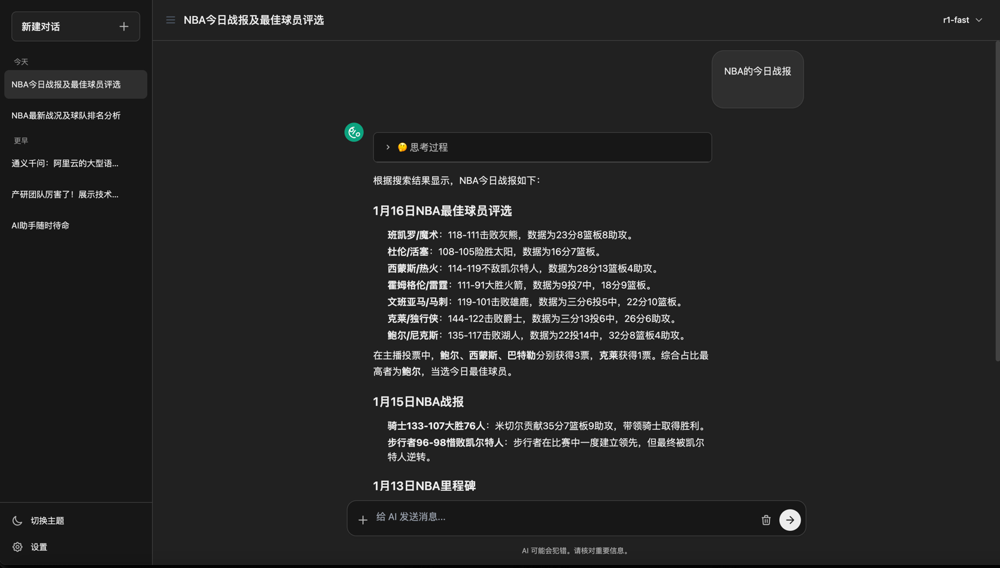

<div align="center">

# SlioChat

**现代化 AI 聊天界面**

[](https://opensource.org/licenses/MIT)
[](https://slio-chat.pages.dev/)

[English](readme_en.md) | [在线体验](https://slio-chat.pages.dev/)



</div>

## 主要特性

- **主题切换** - 亮色/暗色主题无缝切换
- **响应式设计** - 完美支持移动端
- **流式响应** - 实时显示 AI 回复
- **思考可视化** - 展示 AI 思考过程
- **Markdown 渲染** - 支持代码语法高亮
- **对话管理** - 编辑、删除、按日期分组
- **本地存储** - 会话记录保存在浏览器
- **多模型支持** - 自定义 API 配置

## 快速开始

```bash
# 克隆项目
git clone https://github.com/user/slio-chat.git
cd slio-chat

# 安装依赖
npm install

# 启动开发服务器
npm run dev
```

打开 http://localhost:5173，在设置中配置 API URL 和 Key 即可使用。

## 构建部署

```bash
npm run build
```

部署 `dist/index.html` 到任意静态服务器。

## 技术栈

Svelte 5 · TypeScript · Vite · TailwindCSS · Marked.js · Highlight.js

## 支持的模型

GPT · Claude · DeepSeek · Qwen · GLM · 其他 OpenAI 兼容 API

## License

[MIT](LICENSE)
