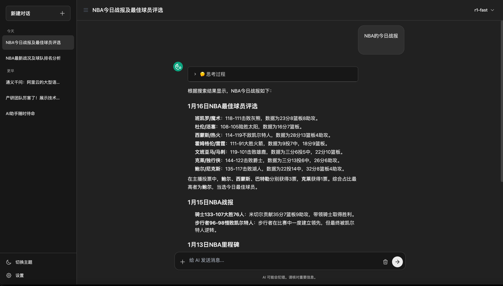

<div align="center">

# SlioChat

**一个轻量级 AI Agent 聊天应用，支持工具调用与虚拟沙箱，让 AI 真正执行任务**

[](https://opensource.org/licenses/MIT)
[](https://slio-chat.pages.dev/)

[在线体验](https://slio-chat.pages.dev/)



</div>

## ✨ 核心特性

### 🤖 Agent 模式
- **工具调用 (Tool Calling)** - 支持 OpenAI 兼容的 function calling，AI 可以主动调用工具完成任务
- **多轮执行** - 自动循环执行直到任务完成，最多支持 100 轮迭代
- **YOLO 模式** - 工具自动执行，无需手动确认，快速完成任务
- **思考可视化** - 展示 AI 的思考过程，支持多轮思考累积显示

### 📁 虚拟沙箱
- **虚拟文件系统** - 基于 IndexedDB 的沙箱环境，AI 可以安全地读写文件
- **文件管理器** - 内置文件浏览器，支持重命名、移动、下载、删除
- **代码编辑器** - 内置编辑器，可直接编辑沙箱中的文件

### 💬 聊天功能
- **流式响应** - 实时显示 AI 回复，支持 SSE 流式传输
- **多模型支持** - 兼容 OpenAI API 格式，支持 GPT、Claude、DeepSeek、Qwen、GLM 等
- **多模态支持** - 支持图片识别与视觉交互
- **文档解析** - 支持 PDF / Word / Excel 文档读取与内容理解
- **Markdown 渲染** - 代码语法高亮、表格、HTML 预览

### 🎨 用户体验
- **主题切换** - 亮色/暗色主题无缝切换
- **响应式设计** - 完美支持移动端
- **本地存储** - 会话记录保存在浏览器，隐私安全
- **对话管理** - 编辑、删除、按日期分组

## 🚀 快速开始

```bash
git clone https://github.com/sk-wang/SlioChat.git
cd slio-chat
npm install
npm run dev
```

打开 http://localhost:5173，在设置中配置 API URL 和 Key 即可使用。

## 📦 构建部署

```bash
npm run build
```

部署 `dist/index.html` 到任意静态服务器，支持：
- Cloudflare Pages
- Vercel
- Netlify
- GitHub Pages
- 任意静态文件服务器

## 🛠 技术栈

- **框架**: Svelte 5 (Runes) + TypeScript
- **构建**: Vite 6
- **样式**: TailwindCSS 4
- **Markdown**: Marked.js + Highlight.js
- **存储**: IndexedDB (虚拟文件系统)

## 🔧 内置工具

| 工具 | 描述 |
|------|------|
| `fs_read` | 读取沙箱中的文件 |
| `fs_write` | 写入文件到沙箱 |
| `fs_delete` | 删除文件或目录 |
| `fs_list` | 列出目录内容 |
| `fs_mkdir` | 创建目录 |
| `fs_move` | 移动文件 |
| `fs_rename` | 重命名文件 |

## 📝 支持的模型

需要支持 **Function Calling / Tool Use** 的模型：

### 国际模型
- **OpenAI**: GPT-4o / GPT-4.1 / o1 / o3-mini
- **Anthropic**: Claude 4 / Claude 3.7 Sonnet / Claude 3.5 (via 兼容 API)
- **Google**: Gemini 2.5 Pro / Gemini 2.0 Flash

### 国产模型
- **DeepSeek**: DeepSeek V3 / R1 (推理模型)
- **阿里**: Qwen 3 / Qwen 2.5-Max / Qwen 2.5-Coder
- **智谱**: GLM-4-Plus / GLM-4.5 / GLM-Z1 (推理模型)
- **字节**: Doubao-1.5-Pro / Seed-1.6
- **月之暗面**: Kimi k1.5
- **MiniMax**: abab7 / abab6.5s
- **百度**: ERNIE 4.5 / ERNIE X1

### 其他
- Grok 2 / Grok 3
- Mistral Large 2
- 其他支持 function calling 的 OpenAI 兼容 API

## 📄 License

[MIT](LICENSE)
