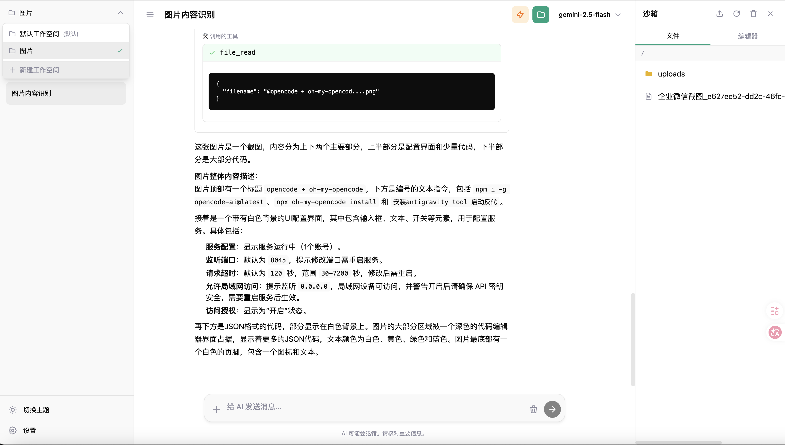
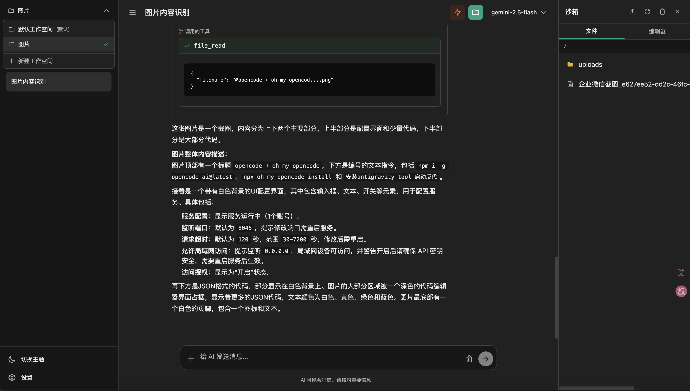

<div align="center">

# SlioChat

**一个轻量级 AI Agent 聊天应用，支持工具调用与虚拟沙箱，让 AI 真正执行任务**

[](https://opensource.org/licenses/MIT)
[](https://slio-chat.pages.dev/)

[在线体验](https://slio-chat.pages.dev/)

<div>
  
  
</div>

</div>

## ✨ 核心特性

### 🤖 Agent 模式
- **工具调用 (Tool Calling)** - 支持 OpenAI 兼容的 function calling，AI 可以主动调用工具完成任务
- **多轮执行** - 自动循环执行直到任务完成，最多支持 100 轮迭代
- **YOLO 模式** - 工具自动执行，无需手动确认，快速完成任务
- **思考可视化** - 展示 AI 的思考过程，支持多轮思考累积显示

### 📁 虚拟沙箱
- **虚拟文件系统** - 基于 IndexedDB 的沙箱环境，AI 可以安全地读写文件
- **文件管理器** - 内置文件浏览器，支持重命名、移动、下载、删除
- **代码编辑器** - 内置编辑器，可直接编辑沙箱中的文件

### 💬 聊天功能
- **流式响应** - 实时显示 AI 回复，支持 SSE 流式传输
- **多模型支持** - 兼容 OpenAI API 格式，支持 GPT、Claude、DeepSeek、Qwen、GLM 等
- **多模态支持** - 支持图片识别与视觉交互
- **文档解析** - 支持 PDF / Word / Excel 文档读取与内容理解
- **Markdown 渲染** - 代码语法高亮、表格、HTML 预览

### 🔍 事实核查与深度研究
- **多源事实核查** - 自动从多个角度搜索验证信息准确性（原文+争议+官方数据）
- **深度研究** - 三阶段系统研究方法论：广度探索 → 深度挖掘 → 交叉验证
- **智能网页提取** - Jina Reader API 自动提取网页正文为 Markdown，无需处理原始 HTML
- **引用溯源** - 回答中自动标注信息来源 `[来源: 标题](URL)`，可追溯可信度

### 🖥️ 沙箱命令行
- **Shell 命令** - 支持 20+ 常用 Linux 命令：ls, cat, grep, sed, awk, head, tail, curl 等
- **文本处理** - 支持正则搜索(grep/rg)、流编辑(sed)、文本分析(awk)、排序去重(sort/uniq)
- **文件操作** - 完整的文件管理：创建(touch/mkdir)、复制(cp)、移动(mv)、删除(rm)

### 🎨 用户体验
- **主题切换** - 亮色/暗色主题无缝切换
- **响应式设计** - 完美支持移动端
- **本地存储** - 会话记录保存在浏览器，隐私安全
- **对话管理** - 编辑、删除、按日期分组

## 🚀 快速开始

```bash
git clone https://github.com/sk-wang/SlioChat.git
cd slio-chat
npm install
npm run dev
```

打开 http://localhost:5173，在设置中配置 API URL 和 Key 即可使用。

## 📦 构建部署

```bash
npm run build
```

部署 `dist/index.html` 到任意静态服务器，支持：
- Cloudflare Pages
- Vercel
- Netlify
- GitHub Pages
- 任意静态文件服务器

## 🛠 技术栈

- **框架**: Svelte 5 (Runes) + TypeScript
- **构建**: Vite 6
- **样式**: TailwindCSS 4
- **Markdown**: Marked.js + Highlight.js
- **存储**: IndexedDB (虚拟文件系统)

## 🔧 内置工具

### 文件与沙箱
| 工具 | 描述 |
|------|------|
| `fs_read` | 读取沙箱中的文件 |
| `fs_write` | 写入文件到沙箱 |
| `fs_delete` | 删除文件或目录 |
| `fs_list` | 列出目录内容 |
| `fs_mkdir` | 创建目录 |
| `run_lua` | 执行 Lua 脚本代码 |
| `shell_command` | 执行类 Linux 命令（ls, cat, grep, sed, awk, curl 等 20+ 命令） |

### 联网搜索与事实核查
| 工具 | 描述 |
|------|------|
| `web_search` | 搜索互联网获取最新信息，支持自定义结果数量 |
| `web_fetch` | 获取网页正文内容（Jina Reader API 自动提取，支持 Markdown 输出） |
| `fact_check` | 多源事实核查 — 从多个角度搜索验证，自动抓取主要来源深入分析 |
| `deep_research` | 深度研究 — 三阶段系统研究（广度探索→深度挖掘→交叉验证） |

### 代码搜索与任务管理
| 工具 | 描述 |
|------|------|
| `code_search` | 在沙箱文件中搜索代码，支持正则表达式和文件类型过滤 |
| `find_files` | 按文件名模式查找文件 |
| `file_info` | 获取文件详细信息 |
| `update_plan` | 创建或更新任务计划 |

## 📝 支持的模型

支持所有兼容 **OpenAI API 格式**且具备 **Function Calling / Tool Use** 能力的模型，包括但不限于：

- OpenAI GPT 系列
- Anthropic Claude 系列
- Google Gemini 系列
- DeepSeek / Qwen / GLM / Doubao / Kimi 等国产模型
- 其他支持 function calling 的 OpenAI 兼容 API

## 📄 License

[MIT](LICENSE)
